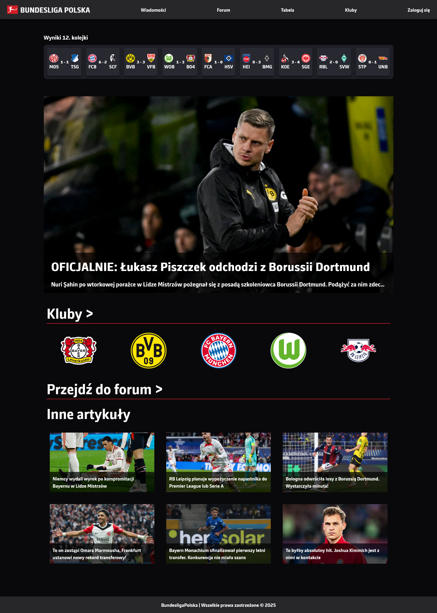
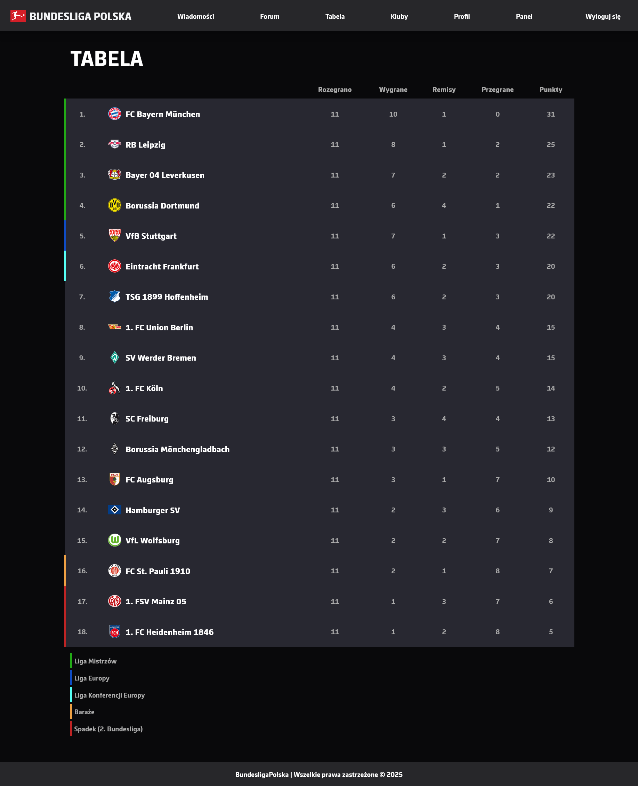
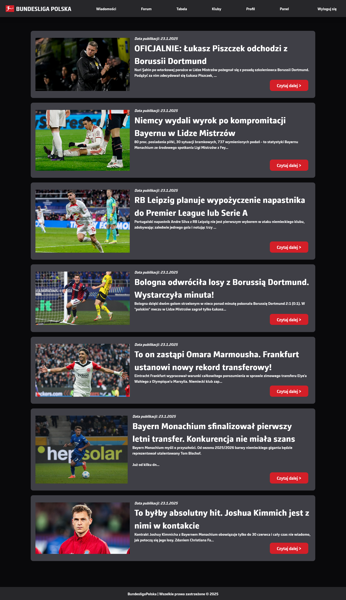
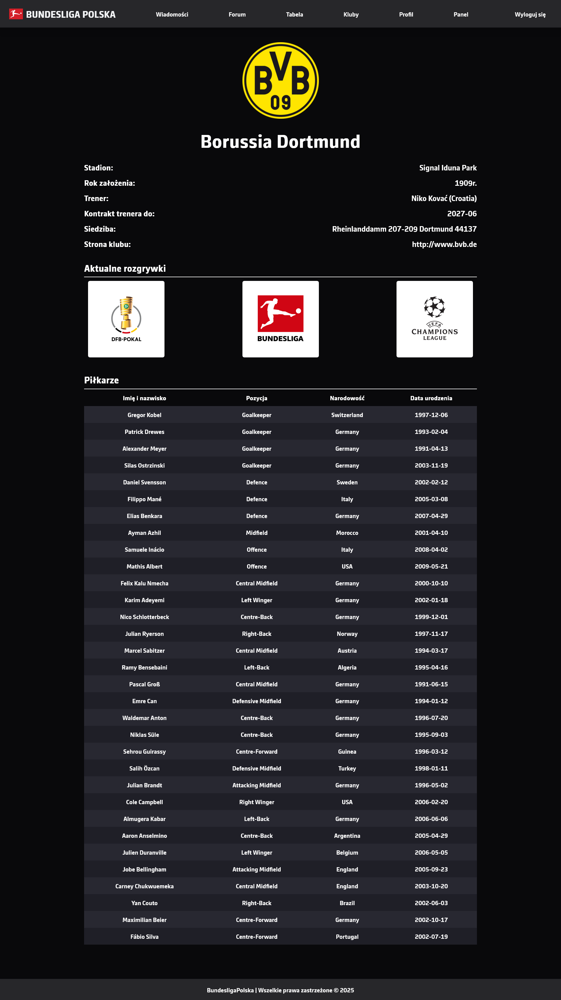
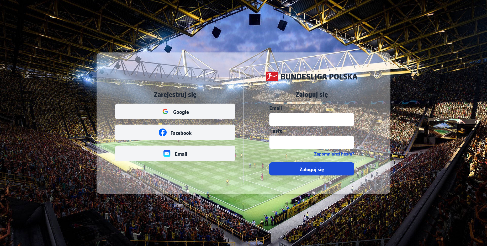

# BundesligaPolska
A Polish-language website dedicated to the German football league — the Bundesliga.
The project provides information about clubs, league standings, and the latest news.
All data is fetched dynamically from an external API.

## About the Project
BundesligaPolska is a web application created for Polish fans of the German football league.\
Its goal is to provide a simple and clean platform where users can easily access:\
•	information about Bundesliga clubs,\
•	the current league table,\
•	the latest news related to teams and the league.\
All presented data is retrieved from an external football API, ensuring that the content stays up to date without manual updates.
________________________________________
## Features
•	List of Bundesliga clubs\
•	Individual club details\
•	Live league standings for the current season\
•	Latest Bundesliga-related news\
•	Automated data fetching from an external API\
•	User-friendly and clear UI
________________________________________
## Technologies
### Frontend:
•	HTML, CSS, React JS
### Backend:
•	Java Spring\
•	External football API integration\
•	PostgreSQL database stored on Docker
________________________________________

## Screenshots






## How to run the backend

Install Maven dependencies

In the terminal in the project directory run the command:
```
mvn clean install
```
Then run the command:
```
docker-compose up
```
Run the Spring Boot application

In the terminal, run the command:
```
mvn spring-boot:run
```
make sure you have openjdk-23 installed

## How to run the Frontend
Install node Modules

In the terminal in the project directory run the command:
```
npm install
```
Run the React application

In the terminal, run the command:
```
npm run dev
```
